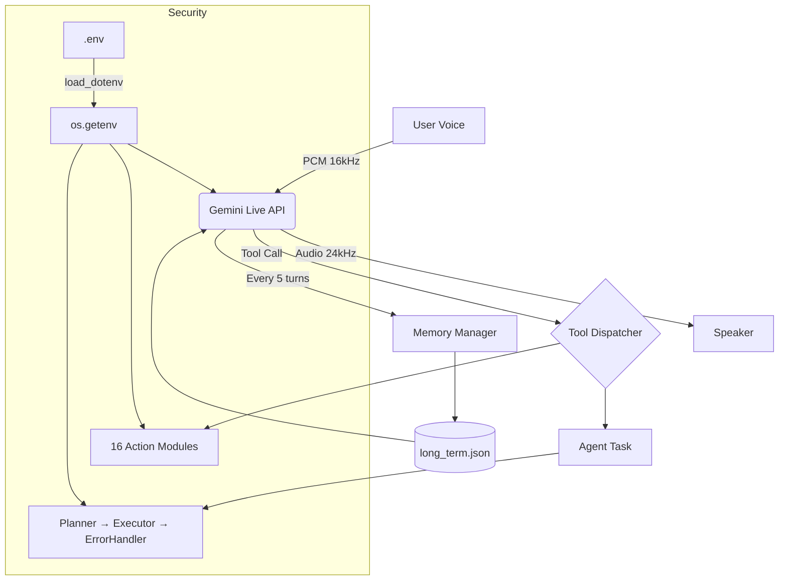

# 🤖 Mark II — Full Project Scan Report

> Generated: 2026-03-27 18:25 IST | Status: ✅ ALL SYSTEMS GREEN

---

## 📁 Directory Structure (Post-Migration)

```
Mark II/                         (Root)
├── .env                         ⬅ SECURE — API key + camera index
├── .gitignore                   ⬅ Protects .env from GitHub
├── main.py                      (35.9 KB) Entry point — Gemini Live session
├── ui.py                        (23.2 KB) Animated Mark II HUD (60fps Tkinter)
├── setup.py                     (985 B)   Smart installer — uv-first, pip fallback
├── requirements.txt             (244 B)   20 dependencies incl. python-dotenv
├── readme.md                    (1.6 KB)  Setup guide with uv instructions
│
├── core/
│   └── prompt.txt               (1.3 KB)  JARVIS persona + tool routing rules
│
├── config/
│   ├── __init__.py
│   └── api_keys.json            ⚠️ LEGACY — no longer read by any module
│
├── memory/
│   ├── __init__.py
│   ├── config_manager.py        ⬅ REWRITTEN — now uses .env via python-dotenv
│   └── memory_manager.py        (4.4 KB)  Persistent user memory (JSON)
│
├── agent/
│   ├── executor.py              (15.5 KB) Multi-step plan runner with retries
│   ├── planner.py               (8.4 KB)  Plan generation via Gemini
│   ├── task_queue.py            (7.3 KB)  Priority task queue (LOW/NORMAL/HIGH)
│   └── error_handler.py         (6.6 KB)  Error classification (RETRY/SKIP/FIX/ABORT)
│
└── actions/                     16 tool modules
    ├── browser_control.py       (16.8 KB) Playwright browser automation
    ├── cmd_control.py           (8.9 KB)  Natural-language → CMD commands
    ├── code_helper.py           (19.5 KB) Write/edit/run/explain/build/debug code
    ├── computer_control.py      (17.9 KB) Mouse, keyboard, clipboard, AI screen-find
    ├── computer_settings.py     (25.5 KB) Volume, brightness, WiFi, window mgmt
    ├── desktop.py               (13.9 KB) Wallpaper, organize, clean desktop
    ├── dev_agent.py             (15.0 KB) Full project builder (plan→write→fix loop)
    ├── file_controller.py       (15.4 KB) File CRUD, search, disk usage
    ├── flight_finder.py         (14.1 KB) Google Flights scraper via Playwright
    ├── open_app.py              (9.0 KB)  Launch any Windows app or website
    ├── reminder.py              (4.7 KB)  Windows Task Scheduler reminders
    ├── screen_processor.py      (12.4 KB) Screenshot/webcam → Gemini Vision
    ├── send_message.py          (6.3 KB)  WhatsApp/Telegram via PyAutoGUI
    ├── weather_report.py        (1.5 KB)  Real-time weather via web API
    ├── web_search.py            (4.3 KB)  DuckDuckGo search
    └── youtube_video.py         (15.9 KB) Play, summarize, trending videos
```

---

## 🔐 Security Audit

| Check | Status | Details |
|:---|:---:|:---|
| `.env` file exists | ✅ | Contains `GEMINI_API_KEY` and `CAMERA_INDEX` |
| `.gitignore` protects `.env` | ✅ | `.env` and `api_keys.json` both listed |
| `api_keys.json` references in code | ✅ **0 found** | All 13 modules migrated to `os.getenv()` |
| Hardcoded API keys in source | ✅ None | Keys only exist in `.env` |
| `python-dotenv` in requirements | ✅ | Listed in `requirements.txt` |

### Files Successfully Migrated (13 total)

| Module | Old Method | New Method |
|:---|:---|:---|
| `main.py` | `json.load(api_keys.json)` | `os.getenv("GEMINI_API_KEY")` |
| `ui.py` | `API_FILE.exists()` | `os.getenv()` + `set_key()` for setup |
| `agent/planner.py` | `json.load(api_keys.json)` | `os.getenv("GEMINI_API_KEY")` |
| `agent/executor.py` | `json.load(api_keys.json)` | `os.getenv("GEMINI_API_KEY")` |
| `agent/error_handler.py` | `json.load(api_keys.json)` | `os.getenv("GEMINI_API_KEY")` |
| `actions/web_search.py` | `json.load(api_keys.json)` | `os.getenv("GEMINI_API_KEY")` |
| `actions/youtube_video.py` | `json.load(api_keys.json)` | `os.getenv("GEMINI_API_KEY")` |
| `actions/computer_settings.py` | `json.load(api_keys.json)` | `os.getenv("GEMINI_API_KEY")` |
| `actions/computer_control.py` | `json.load(api_keys.json)` | `os.getenv("GEMINI_API_KEY")` |
| `actions/screen_processor.py` | `json.load(api_keys.json)` | `os.getenv("GEMINI_API_KEY")` |
| `actions/flight_finder.py` | `json.load(api_keys.json)` | `os.getenv("GEMINI_API_KEY")` |
| `actions/dev_agent.py` | `json.load(api_keys.json)` | `os.getenv("GEMINI_API_KEY")` |
| `actions/desktop.py` | `json.load(api_keys.json)` | `os.getenv("GEMINI_API_KEY")` |
| `actions/cmd_control.py` | `json.load(api_keys.json)` | `os.getenv("GEMINI_API_KEY")` |
| `actions/code_helper.py` | `json.load(api_keys.json)` | `os.getenv("GEMINI_API_KEY")` |
| `memory/config_manager.py` | `json.load(api_keys.json)` | `os.getenv()` + `set_key()` |

---

## 🏷️ Branding Audit

| Check | Status |
|:---|:---:|
| `MARK XXX` references in code | ✅ **0 found** |
| `Mark-XXX` references in code | ✅ **0 found** |
| `FatihMakes` references | ✅ **0 found** |
| UI window title → Mark II | ✅ |
| UI footer → MARK II | ✅ |
| README title → Mark II | ✅ |
| Setup message → Mark II | ✅ |
| Agent prompts → Mark II | ✅ |

---

## ⚙️ Architecture



---

## 📦 Dependencies (20 packages)

| Package | Purpose |
|:---|:---|
| `python-dotenv` | Secure environment variable management |
| `pyaudio` | Mic input & speaker output |
| `google-genai` | Gemini Live API (v1beta) |
| `google-generativeai` | Standard Gemini SDK |
| `pillow` | Face image processing in UI |
| `playwright` | Browser automation |
| `pyautogui` | Mouse/keyboard control |
| `pyperclip` | Clipboard access |
| `opencv-python` | Webcam capture |
| `mss` | Screen capture |
| `numpy` | Image processing |
| `psutil` | Process/system info |
| `send2trash` | Safe file deletion |
| `comtypes` + `pycaw` | Windows audio volume |
| `win10toast` | Windows notifications |
| `duckduckgo-search` | Web search |
| `youtube-transcript-api` | YouTube subtitles |
| `beautifulsoup4` | HTML parsing |
| `requests` | HTTP calls |

---

## ⚠️ Recommendations

| Priority | Issue | Fix |
|:---:|:---|:---|
| 🟡 | `config/api_keys.json` still exists on disk | Safe to delete — no code reads it anymore |
| 🟡 | `core/prompt.txt` still says "JARVIS" not "Mark II" | Optional: update persona name |
| 🟡 | `screen_processor.py` SYSTEM_PROMPT says "JARVIS" | Optional: update to Mark II |
| 🟢 | `screen_processor.py` runs a separate Gemini session | Consider merging to save tokens |
| 🟢 | No `uv.lock` file | Run `uv pip compile` to lock versions |

---

## 🚀 Quick Start

```powershell
pip install uv          # One-time: install fast package manager
python setup.py         # Install all dependencies via uv
python main.py          # Launch Mark II
```

---

*Mark II Audit System — All systems nominal* ✅
